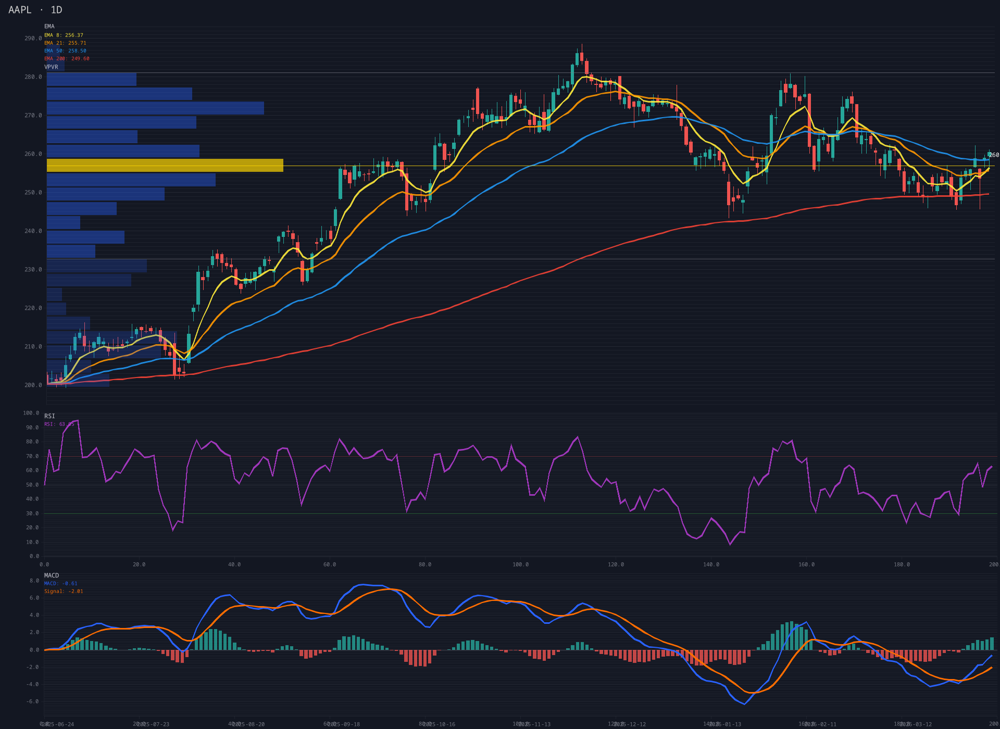

# chartgen

Trading chart generator, MCP server, and live trading engine in Rust. Fetches data from Yahoo Finance and Binance, renders 37 technical indicators as PNG candlestick charts, streams WebSocket quotes into a trading engine with alerts, and integrates with Claude.ai via OAuth 2.1 PKCE.



## Quick Start

```bash
# Prerequisites: Rust 1.76+, fontconfig/freetype dev libs
sudo apt-get install libfontconfig1-dev libfreetype-dev  # Debian/Ubuntu

git clone https://github.com/5queezer/chartgen.git && cd chartgen
cargo build --release

# Generate a chart
cargo run -- --symbol AAPL --interval 1d -p ema_stack -p vpvr -p rsi -p macd --output chart.png

# Run as MCP server for Claude Desktop
cargo run -- --mcp

# Run as HTTP server for Claude.ai
cargo run -- --serve

# Run in live trading mode (WebSocket feed + alerts + trading tools)
cargo run -- --serve --trade --testnet
```

## CLI

| Flag | Description | Default |
|------|-------------|---------|
| `--symbol` / `-s` | Ticker (AAPL, BTCUSDT) | Sample data |
| `--interval` / `-i` | 1m, 5m, 15m, 1h, 4h, 1d, 1wk | `4h` |
| `-p` | Indicator (repeat for multiple) | `cipher_b`, `macd` |
| `-n` / `--bars` | Number of bars | `120` |
| `--width` / `--height` | Image dimensions | 1920 x 1080 |
| `--output` / `-o` | Output path | `chart.png` |
| `--source` | `auto`, `binance`, `yahoo` | `auto` |
| `--mcp` | MCP stdio mode | |
| `--serve` | HTTP server mode | |
| `--port` | Server port | `9315` |
| `--trade` | Enable trading engine (WebSocket feed, orders, alerts) | |
| `--testnet` | Use Binance testnet (paper trading) | |

Auto-detection: `USDT`/`BTC`/`ETH` suffixes → Binance, everything else → Yahoo Finance.

## Indicators

37 indicators in 5 categories. All configurable via MCP parameters.

<details>
<summary><strong>Overlays</strong> (16) — drawn on price chart</summary>

| Name | Aliases |
|------|---------|
| `ema_stack` | `ema` |
| `bbands` | `bb`, `bollinger` |
| `keltner` | `kc` |
| `donchian` | `dc` |
| `supertrend` | `st` |
| `sar` | `psar`, `parabolic_sar` |
| `ichimoku` | `ichi` |
| `heikin_ashi` | `ha` |
| `vwap` | |
| `vwap_bands` | |
| `pivot` | `pivot_points` |
| `vpvr` | `vp`, `volume_profile` |
| `session_vp` | `svp`, `session_volume_profile` |
| `hvn_lvn` | `vp_nodes`, `volume_nodes` |
| `naked_poc` | `npoc` |
| `tpo` | `market_profile` |

</details>

<details>
<summary><strong>Momentum</strong> (10)</summary>

| Name | Aliases |
|------|---------|
| `rsi` | |
| `macd` | |
| `stoch` | `stochastic` |
| `cci` | |
| `williams_r` | `willr` |
| `roc` | |
| `wavetrend` | `wt` |
| `cipher_b` | `cipher`, `cb` |
| `adx` | |
| `rsi_mfi_stoch` | `rsi_combo`, `combo` |

</details>

<details>
<summary><strong>Volatility</strong> (3) · <strong>Volume</strong> (5) · <strong>Crypto</strong> (4)</summary>

| Name | Aliases | Category |
|------|---------|----------|
| `atr` | | Volatility |
| `histvol` | `hv` | Volatility |
| `kalman_volume` | `kalman`, `kvf` | Volatility |
| `obv` | | Volume |
| `mfi` | | Volume |
| `cmf` | | Volume |
| `ad` | `ad_line` | Volume |
| `cvd` | | Volume |
| `funding` | `funding_rate` | Crypto |
| `oi` | `open_interest` | Crypto |
| `long_short` | `ls_ratio` | Crypto |
| `fear_greed` | `fng` | Crypto |

</details>

### Parameter Examples (MCP)

```json
{"name": "rsi", "length": 21}
{"name": "bbands", "length": 30, "mult": 2.5}
{"name": "vpvr", "bins": 32, "side": "right"}
```

## MCP Integration

### Claude Desktop

```json
{
  "mcpServers": {
    "chartgen": {
      "command": "/path/to/chartgen",
      "args": ["--mcp"]
    }
  }
}
```

### Claude.ai

Add `https://chartgen.vasudev.xyz` as a remote MCP connector. OAuth 2.1 PKCE is handled automatically.

### Tools

Charting:
- **`generate_chart`** — render a chart. `format` can be `png` (default), `summary` (compact JSON with OHLCV stats, last indicator values, signals, divergences, and levels — 10–50× cheaper in tokens than a PNG), or `both`.
- **`list_indicators`** — discover all 37 indicators with parameters.
- **`get_indicators`** — compute indicators and return raw numeric values as JSON.

Trading (require `--trade`):
- **`place_order`**, **`cancel_order`**, **`get_orders`** — order lifecycle
- **`get_positions`**, **`get_balance`** — account state
- **`set_alert`**, **`list_alerts`**, **`cancel_alert`** — price / indicator-signal alerts
- **`get_notifications`** — drain triggered-alert queue (poll)
- **`subscribe_notifications`**, **`unsubscribe_notifications`**, **`list_subscriptions`** — push notifications via SSE

## Architecture

```
src/
├── main.rs              CLI + mode dispatch
├── lib.rs               Library root
├── data.rs              Bar, OhlcvData
├── indicator.rs         Indicator trait, PanelResult, Line/Fill/HBar
├── indicator_state.rs   Streaming indicator state for the engine
├── mtf.rs               Multi-timeframe aggregation
├── indicators/
│   ├── mod.rs           Registry (by_name, available, registry)
│   ├── ta_bridge.rs     ta-rs wrappers
│   ├── custom.rs        custom indicators (incl. volume-profile family)
│   ├── cipher_b.rs      Cipher B (Pine Script port)
│   ├── external.rs      API-based indicators
│   ├── macd.rs          MACD
│   ├── rsi.rs           RSI
│   ├── rsi_combo.rs     RSI + MFI + Stoch combo panel
│   └── wavetrend.rs     WaveTrend
├── fetch.rs             Yahoo Finance + Binance REST
├── feed.rs              Binance WebSocket kline feed
├── engine.rs            Trading engine (live bars, indicators, alerts)
├── trading/
│   ├── alert.rs         Alert conditions and matching
│   ├── exchange.rs      Exchange client abstraction
│   ├── order.rs         Order types + store
│   ├── position.rs      Position tracking + PnL
│   ├── signals.rs       Shared signal-label constants
│   ├── subscription.rs  Push-notification SubscriptionRegistry
│   └── persistence.rs   Alert/order persistence
├── renderer.rs          plotters-based chart rendering
├── mcp.rs               MCP JSON-RPC (stdio + HTTP shared)
└── server.rs            axum HTTP, OAuth 2.1 PKCE, SSE
```

## Deployment

### Docker

```bash
docker build -t chartgen .
docker run -p 9315:9315 -e CHARTGEN_BASE_URL=https://your-domain.com chartgen
```

2-stage build: `rust:1.86-slim` → `debian:bookworm-slim` (~93MB).

### CI/CD

Push to `master` → GitHub Actions runs check/test/clippy/fmt → on success, Coolify auto-deploys via its `/deploy` endpoint.

Required secrets: `COOLIFY_API_TOKEN`, `COOLIFY_APP_UUID`, `COOLIFY_BASE_URL`.

## Testing

```bash
cargo test          # e2e + unit tests
cargo fmt --check   # enforced by pre-commit hook
cargo clippy -- -D warnings
```

## License

MIT
