<!-- Generated by `cargo run --example gen_docs`. Do not edit by hand. -->

Indicators live in three buckets in the registry (`src/indicators/mod.rs`):

- **Overlays** draw on the price chart (bands, clouds, volume profiles).
- **Panels** render as separate rows below the price chart (oscillators, volume).
- **External** pull from third-party APIs (Binance derivatives, alternative.me).

Every name and every alias below is accepted by the CLI (`-p <name>`) and by
the `generate_chart` MCP tool's `indicators` parameter. Screenshots are
rendered from `AAPL` daily data (overlays and panels) and `BTCUSDT` daily
data (external) — regenerate with `./scripts/gen_screenshots.sh`.

## Overlays

### Summary

| Name | Aliases |
|------|---------|
| [`ema_stack`](#ema_stack) | `ema` |
| [`bbands`](#bbands) | `bollinger` |
| [`keltner`](#keltner) |  |
| [`donchian`](#donchian) |  |
| [`vwap`](#vwap) |  |
| [`vwap_bands`](#vwap_bands) |  |
| [`supertrend`](#supertrend) |  |
| [`sar`](#sar) | `parabolic_sar` |
| [`ichimoku`](#ichimoku) |  |
| [`heikin_ashi`](#heikin_ashi) | `ha` |
| [`pivot`](#pivot) | `pivot_points` |
| [`volume_profile`](#volume_profile) | `vp`, `vpvr` |
| [`session_vp`](#session_vp) | `svp`, `session_volume_profile` |
| [`hvn_lvn`](#hvn_lvn) | `vp_nodes`, `volume_nodes` |
| [`naked_poc`](#naked_poc) | `npoc` |
| [`tpo`](#tpo) | `market_profile` |

### `ema_stack`

EMA Stack — 4 exponential moving averages (8/21/50/200)

**Aliases:** `ema`

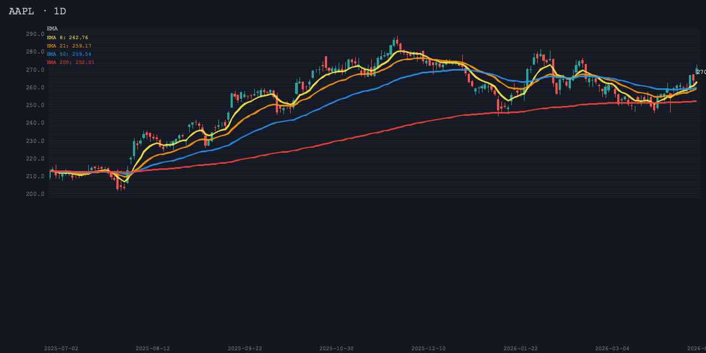

### `bbands`

Bollinger Bands — volatility bands around SMA

**Aliases:** `bollinger`

**Parameters:**

| Param | Type | Default | Description |
|-------|------|---------|-------------|
| `period` | `integer` | `20` |  |
| `std_dev` | `number` | `2.0` |  |

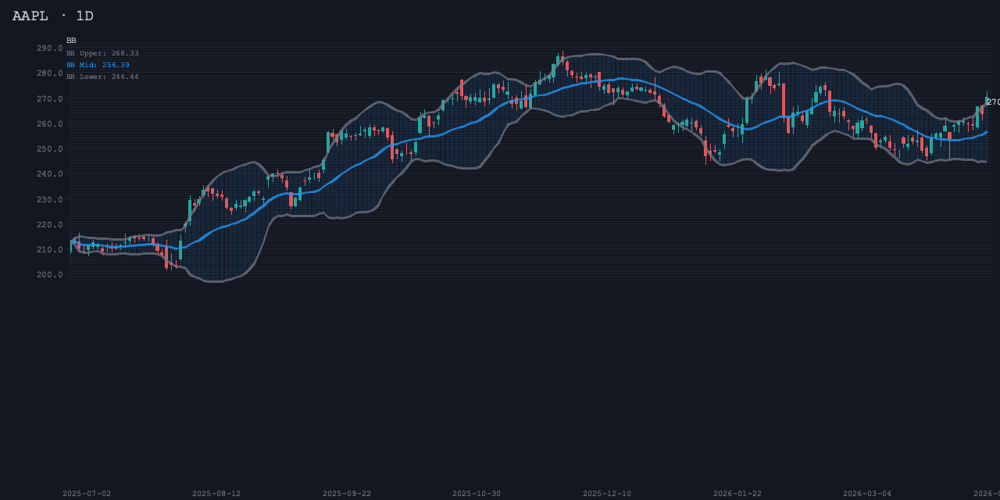

### `keltner`

Keltner Channels — ATR-based volatility bands

**Parameters:**

| Param | Type | Default | Description |
|-------|------|---------|-------------|
| `period` | `integer` | `20` |  |
| `multiplier` | `number` | `1.5` |  |

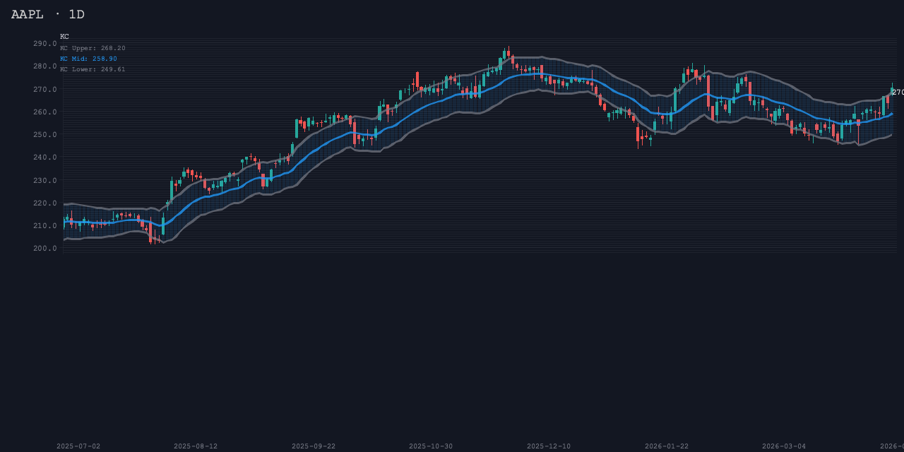

### `donchian`

Donchian Channels — breakout trading bands

**Parameters:**

| Param | Type | Default | Description |
|-------|------|---------|-------------|
| `period` | `integer` | `20` |  |

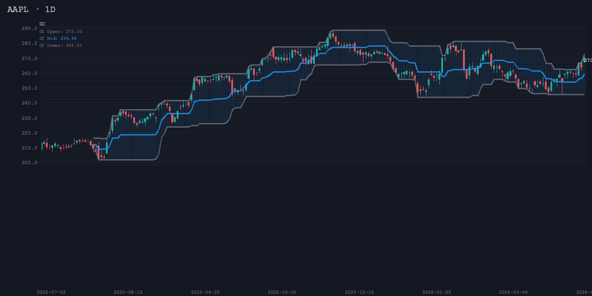

### `vwap`

Volume Weighted Average Price — intraday anchor

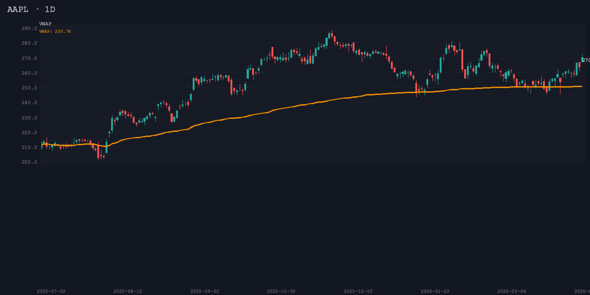

### `vwap_bands`

VWAP Bands — standard deviation bands around VWAP

**Parameters:**

| Param | Type | Default | Description |
|-------|------|---------|-------------|
| `std_dev` | `number` | `2.0` |  |

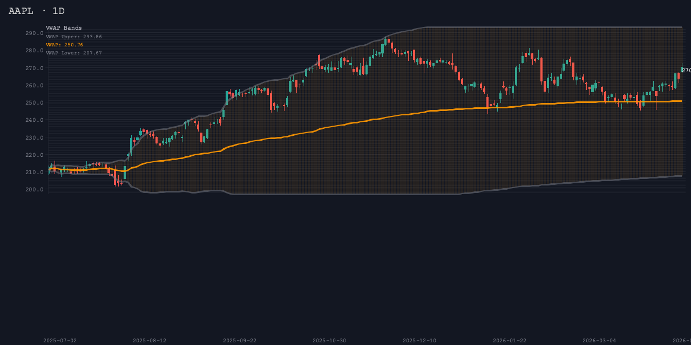

### `supertrend`

Supertrend — ATR-based trend follower

**Parameters:**

| Param | Type | Default | Description |
|-------|------|---------|-------------|
| `period` | `integer` | `10` |  |
| `multiplier` | `number` | `3.0` |  |

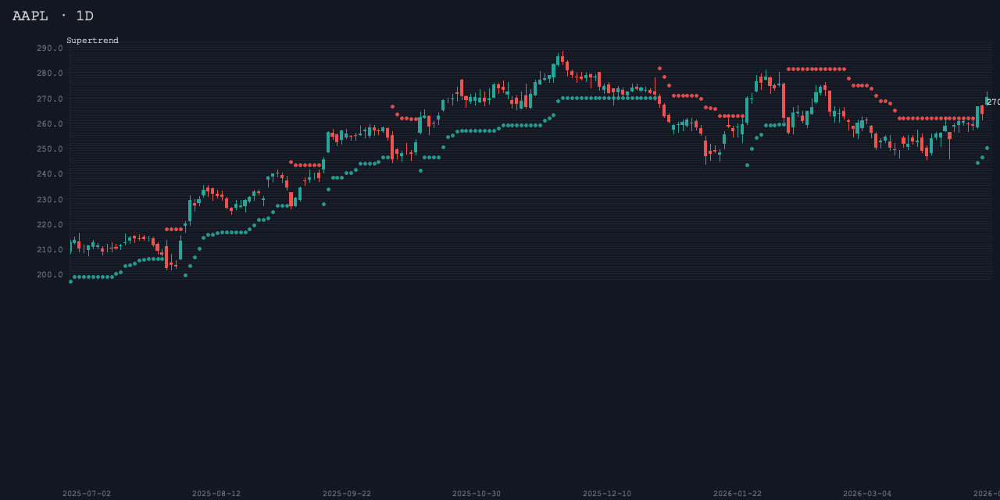

### `sar`

Parabolic SAR — trailing stop / trend reversal

**Aliases:** `parabolic_sar`

**Parameters:**

| Param | Type | Default | Description |
|-------|------|---------|-------------|
| `af_start` | `number` | `0.02` |  |
| `af_step` | `number` | `0.02` |  |
| `af_max` | `number` | `0.2` |  |

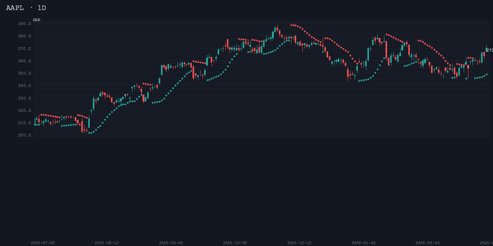

### `ichimoku`

Ichimoku Cloud — trend, support/resistance, momentum

**Parameters:**

| Param | Type | Default | Description |
|-------|------|---------|-------------|
| `tenkan` | `integer` | `9` |  |
| `kijun` | `integer` | `26` |  |
| `senkou_b` | `integer` | `52` |  |

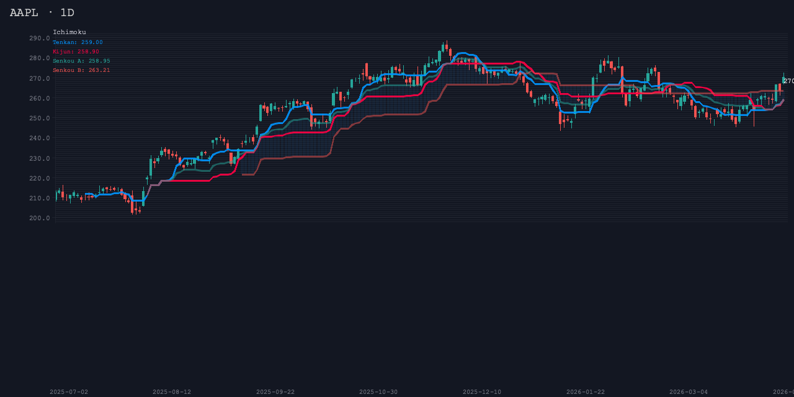

### `heikin_ashi`

Heikin Ashi — smoothed trend candles

**Aliases:** `ha`

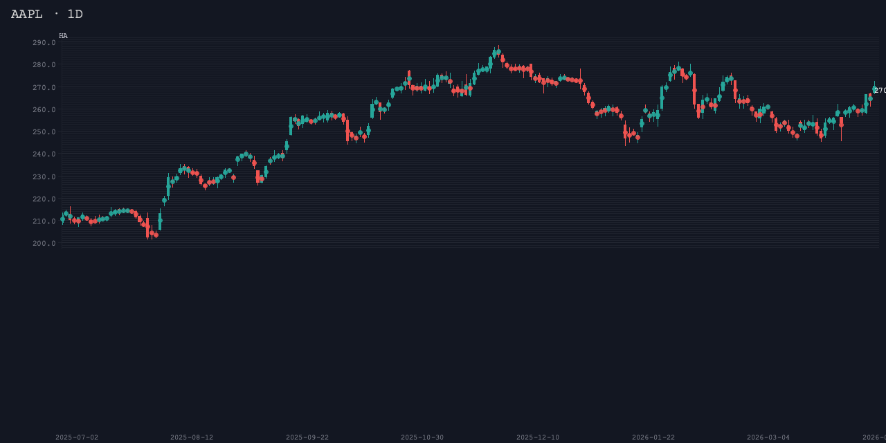

### `pivot`

Pivot Points — support/resistance from prior bar

**Aliases:** `pivot_points`

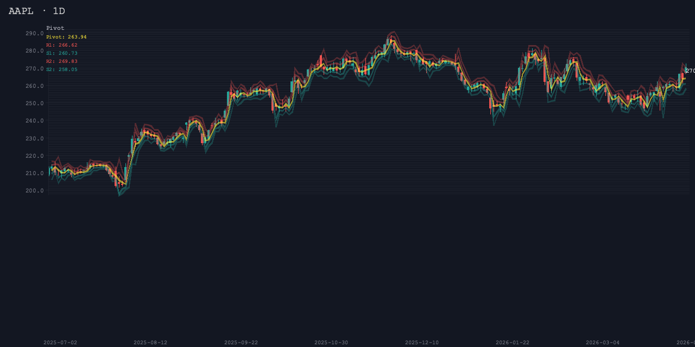

### `volume_profile`

Volume Profile Visible Range — horizontal volume histogram with POC/VAH/VAL

**Aliases:** `vp`, `vpvr`

**Parameters:**

| Param | Type | Default | Description |
|-------|------|---------|-------------|
| `bins` | `integer` | `24` |  |
| `side` | `string` | `left` | left or right |
| `range_bars` | `integer` | `null` | only compute over last N bars (null = all) |
| `split_up_down` | `boolean` | `false` | separate up/down volume colors |
| `color_up` | `string` | `#26a69a` | hex color for up-volume |
| `color_down` | `string` | `#ef5350` | hex color for down-volume |
| `opacity` | `number` | `0.35` | overall opacity multiplier (0.0-1.0) |

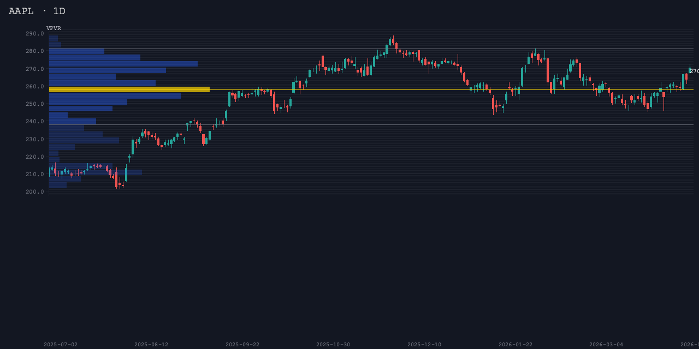

### `session_vp`

Session Volume Profile — per-session POC/VAH/VAL that reset each day/week

**Aliases:** `svp`, `session_volume_profile`

**Parameters:**

| Param | Type | Default | Description |
|-------|------|---------|-------------|
| `bins` | `integer` | `24` |  |
| `session` | `string` | `daily` | daily, weekly, or hourly |
| `bars_per_session` | `integer` | `null` | override session by fixed bar count |
| `show_value_area` | `boolean` | `true` | draw VAH/VAL in addition to POC |

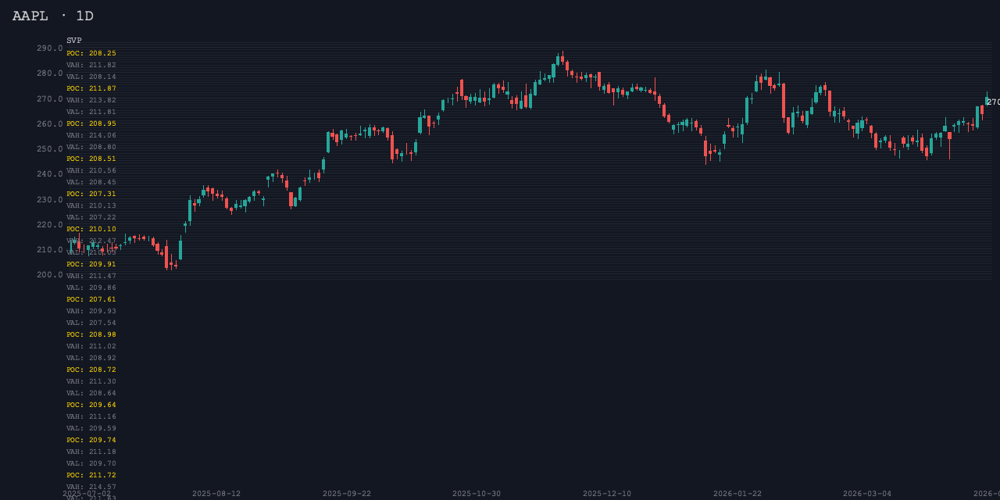

### `hvn_lvn`

High/Low Volume Nodes — auto-detected support/resistance from the volume profile

**Aliases:** `vp_nodes`, `volume_nodes`

**Parameters:**

| Param | Type | Default | Description |
|-------|------|---------|-------------|
| `bins` | `integer` | `48` |  |
| `range_bars` | `integer` | `null` | only scan the last N bars (null = all) |
| `neighborhood` | `integer` | `2` | bins on each side to compare for local extrema |
| `min_prominence` | `number` | `0.1` | minimum relative prominence (0-1) vs max bin |
| `top_n` | `integer` | `null` | keep only the N strongest nodes of each kind |
| `show_hvn` | `boolean` | `true` |  |
| `show_lvn` | `boolean` | `true` |  |

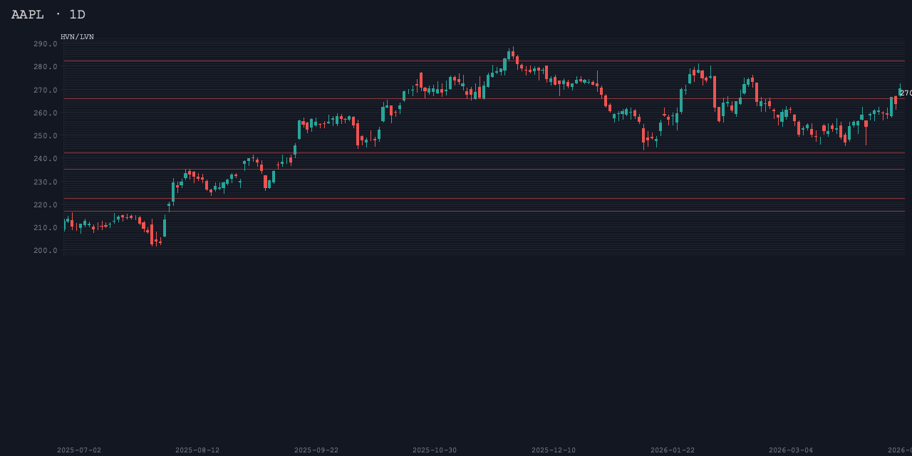

### `naked_poc`

Naked POCs — unfilled point-of-control levels from previous sessions

**Aliases:** `npoc`

**Parameters:**

| Param | Type | Default | Description |
|-------|------|---------|-------------|
| `bins` | `integer` | `24` |  |
| `session` | `string` | `daily` | daily, weekly, hourly |
| `bars_per_session` | `integer` | `null` |  |
| `max_sessions` | `integer` | `20` | look back at most N sessions |
| `include_current` | `boolean` | `true` | also draw the developing POC of the current session |

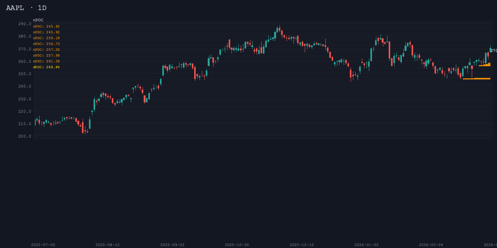

### `tpo`

Time Price Opportunity — time-based market profile with POC/VAH/VAL

**Aliases:** `market_profile`

**Parameters:**

| Param | Type | Default | Description |
|-------|------|---------|-------------|
| `bins` | `integer` | `32` |  |
| `side` | `string` | `right` | left or right |
| `range_bars` | `integer` | `null` | only compute over last N bars |
| `opacity` | `number` | `0.35` | bar opacity (0.0-1.0) |

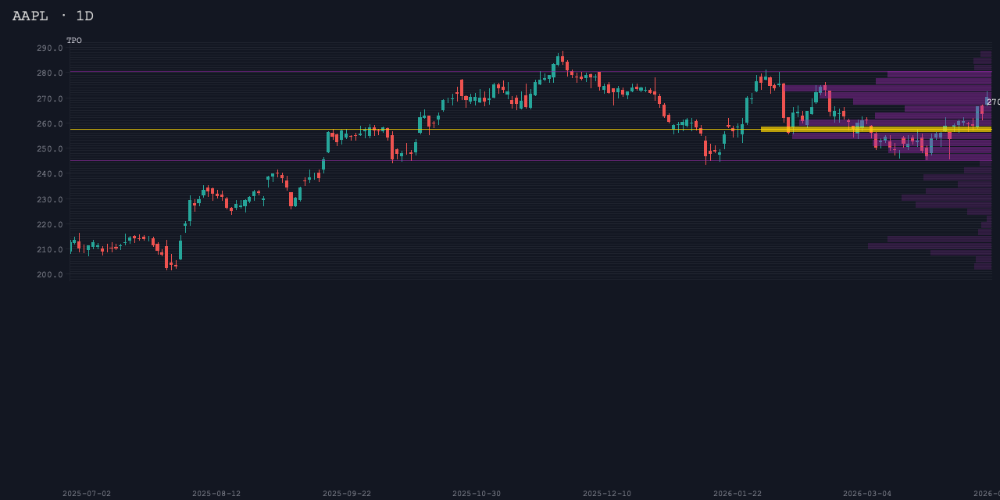

## Panels

### Summary

| Name | Aliases |
|------|---------|
| [`cipher_b`](#cipher_b) |  |
| [`macd`](#macd) |  |
| [`rsi`](#rsi) |  |
| [`wavetrend`](#wavetrend) |  |
| [`stoch`](#stoch) | `stochastic` |
| [`atr`](#atr) |  |
| [`obv`](#obv) |  |
| [`cci`](#cci) |  |
| [`roc`](#roc) |  |
| [`mfi`](#mfi) |  |
| [`williams_r`](#williams_r) | `willr` |
| [`cmf`](#cmf) |  |
| [`adx`](#adx) |  |
| [`ad`](#ad) | `ad_line` |
| [`histvol`](#histvol) | `hv` |
| [`kalman_volume`](#kalman_volume) | `kalman`, `kvf` |
| [`rsi_mfi_stoch`](#rsi_mfi_stoch) | `rsi_combo`, `combo` |

### `cipher_b`

Market Cipher B — composite (WaveTrend + divergences + RSI + Stoch RSI + MFI)

**Parameters:**

| Param | Type | Default | Description |
|-------|------|---------|-------------|
| `dot_mode` | `string` | `strict` | classic (WT cross only) or strict (with RSI+StochRSI filter) |
| `wt_channel_length` | `integer` | `9` |  |
| `wt_average_length` | `integer` | `12` |  |
| `wt_oversold` | `number` | `-53` |  |
| `wt_overbought` | `number` | `53` |  |
| `show_divergences` | `boolean` | `true` | render divergence lines on wave trend |

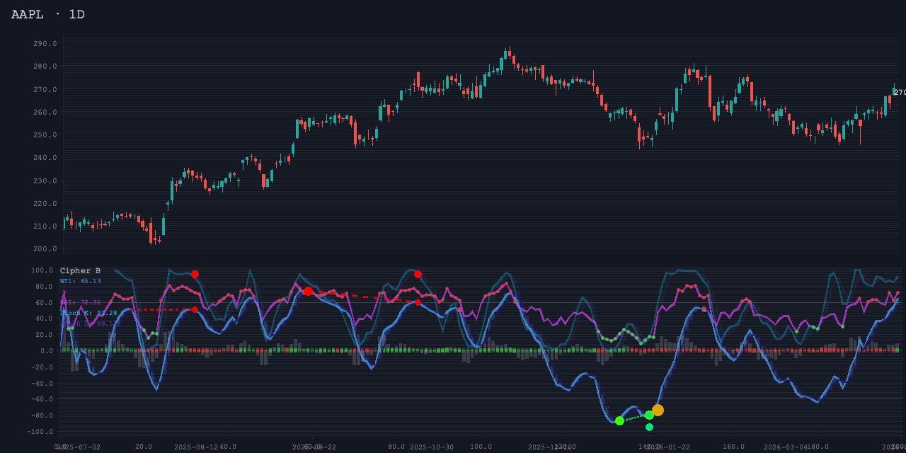

### `macd`

Moving Average Convergence Divergence — trend momentum

**Parameters:**

| Param | Type | Default | Description |
|-------|------|---------|-------------|
| `fast` | `integer` | `12` |  |
| `slow` | `integer` | `26` |  |
| `signal` | `integer` | `9` |  |

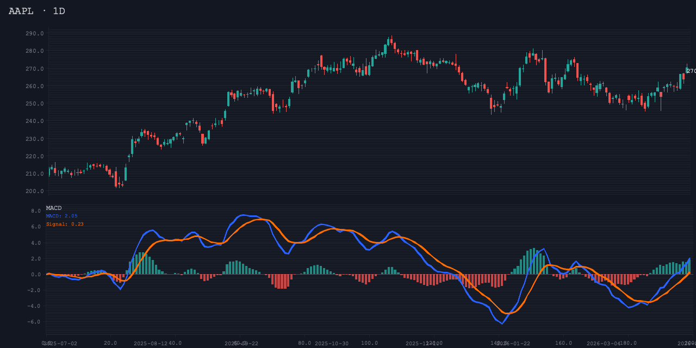

### `rsi`

Relative Strength Index — momentum oscillator (0-100)

**Parameters:**

| Param | Type | Default | Description |
|-------|------|---------|-------------|
| `length` | `integer` | `14` | RSI period |

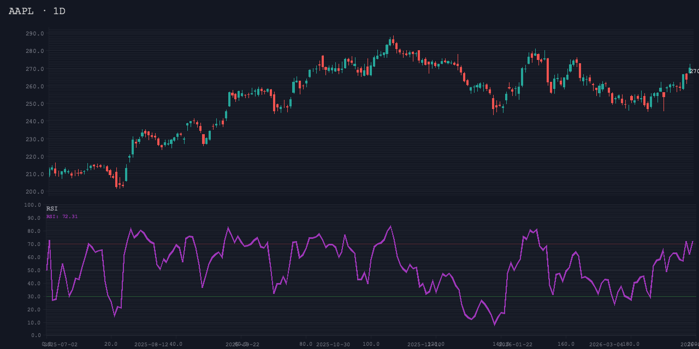

### `wavetrend`

WaveTrend Oscillator — cycle-based momentum

**Parameters:**

| Param | Type | Default | Description |
|-------|------|---------|-------------|
| `ch_len` | `integer` | `9` |  |
| `avg_len` | `integer` | `12` |  |

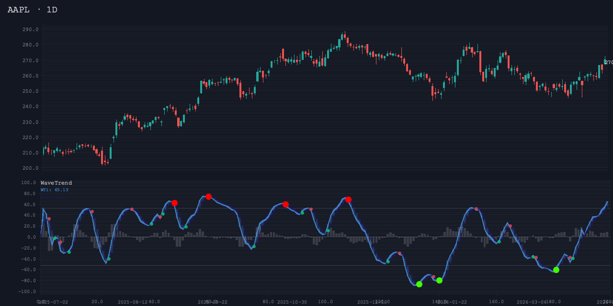

### `stoch`

Slow Stochastic — overbought/oversold oscillator

**Aliases:** `stochastic`

**Parameters:**

| Param | Type | Default | Description |
|-------|------|---------|-------------|
| `period` | `integer` | `14` |  |
| `k_smooth` | `integer` | `3` |  |
| `d_smooth` | `integer` | `3` |  |

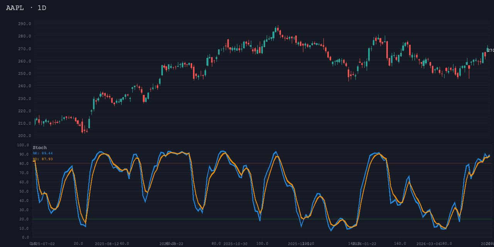

### `atr`

Average True Range — volatility measure

**Parameters:**

| Param | Type | Default | Description |
|-------|------|---------|-------------|
| `period` | `integer` | `14` |  |

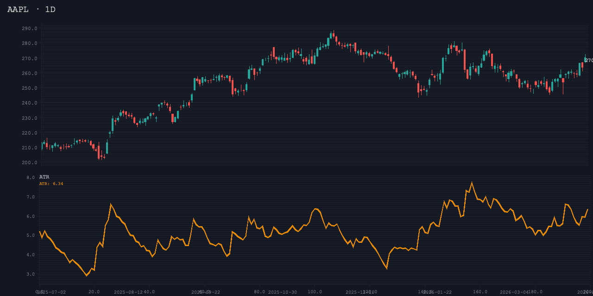

### `obv`

On-Balance Volume — cumulative volume flow

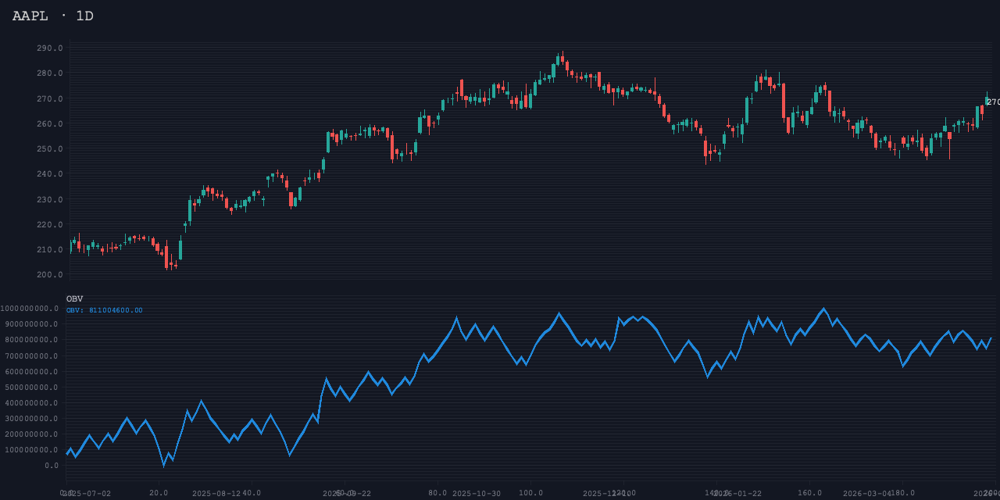

### `cci`

Commodity Channel Index — cyclical momentum

**Parameters:**

| Param | Type | Default | Description |
|-------|------|---------|-------------|
| `period` | `integer` | `20` |  |

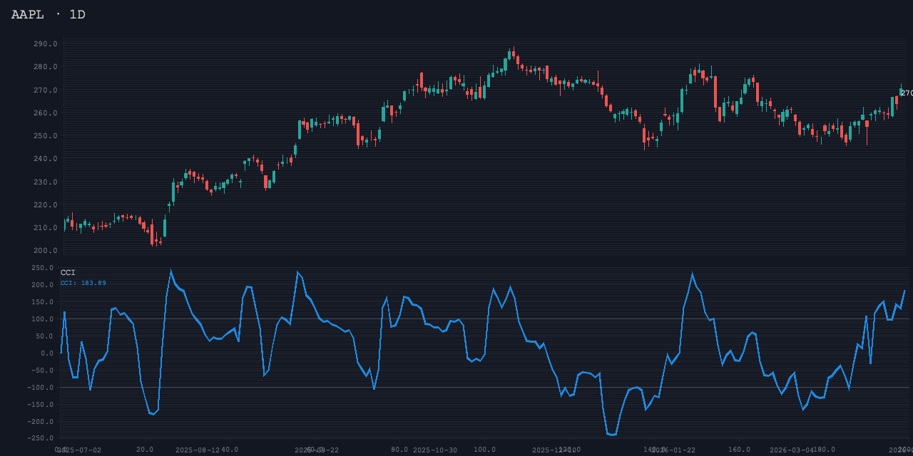

### `roc`

Rate of Change — momentum percentage

**Parameters:**

| Param | Type | Default | Description |
|-------|------|---------|-------------|
| `period` | `integer` | `14` |  |

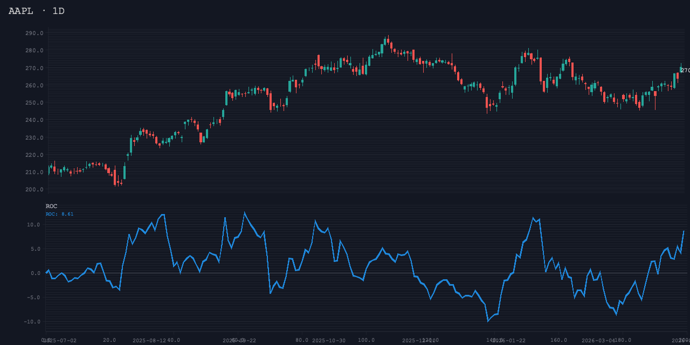

### `mfi`

Money Flow Index — volume-weighted RSI

**Parameters:**

| Param | Type | Default | Description |
|-------|------|---------|-------------|
| `period` | `integer` | `14` |  |

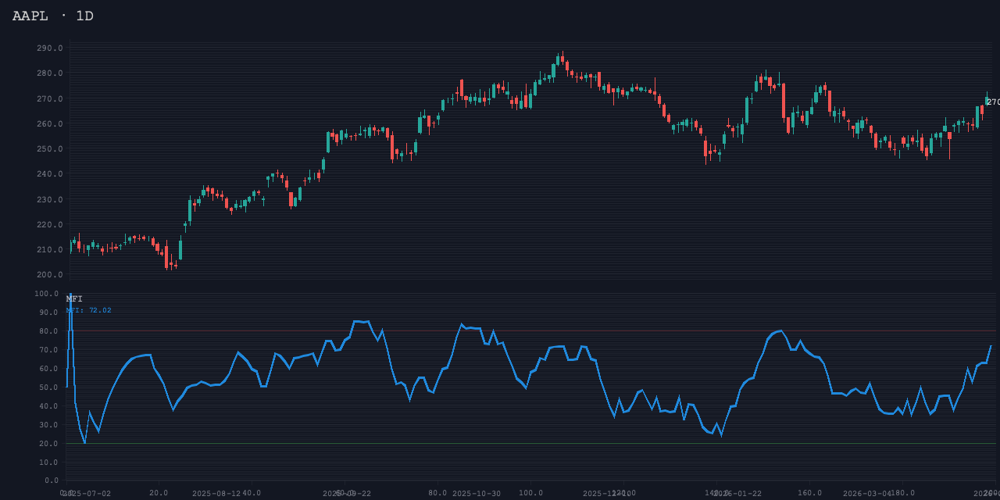

### `williams_r`

Williams %R — momentum reversal indicator

**Aliases:** `willr`

**Parameters:**

| Param | Type | Default | Description |
|-------|------|---------|-------------|
| `period` | `integer` | `14` |  |

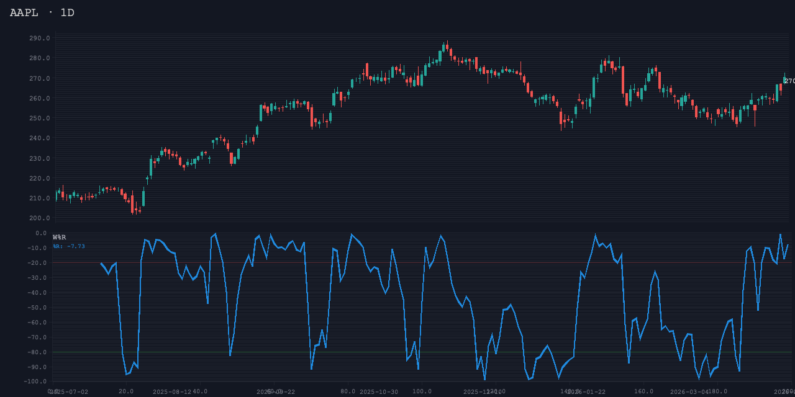

### `cmf`

Chaikin Money Flow — buying/selling pressure

**Parameters:**

| Param | Type | Default | Description |
|-------|------|---------|-------------|
| `period` | `integer` | `20` |  |

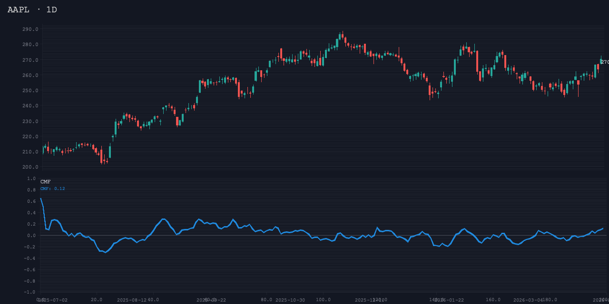

### `adx`

Average Directional Index — trend strength with +DI/-DI

**Parameters:**

| Param | Type | Default | Description |
|-------|------|---------|-------------|
| `period` | `integer` | `14` |  |

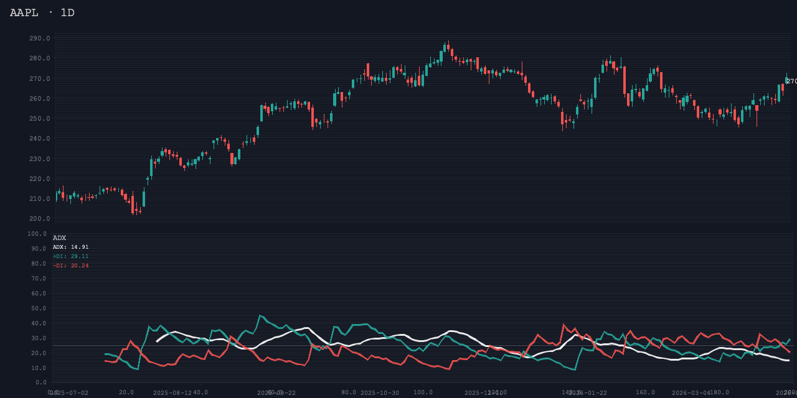

### `ad`

Accumulation/Distribution Line — volume flow

**Aliases:** `ad_line`

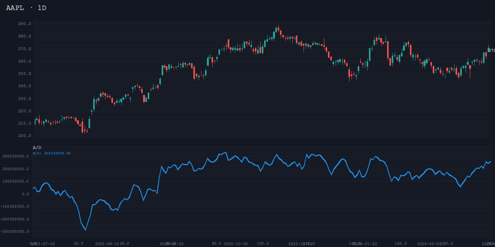

### `histvol`

Historical Volatility — annualized log-return std dev

**Aliases:** `hv`

**Parameters:**

| Param | Type | Default | Description |
|-------|------|---------|-------------|
| `period` | `integer` | `20` |  |

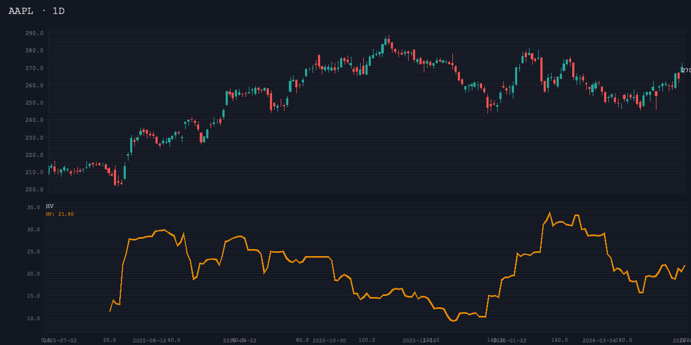

### `kalman_volume`

Kalman Volume Filter — smoothed volume zone oscillator

**Aliases:** `kalman`, `kvf`

**Parameters:**

| Param | Type | Default | Description |
|-------|------|---------|-------------|
| `vzo_length` | `integer` | `70` |  |
| `k` | `number` | `0.06` |  |
| `sig_length` | `integer` | `10` |  |

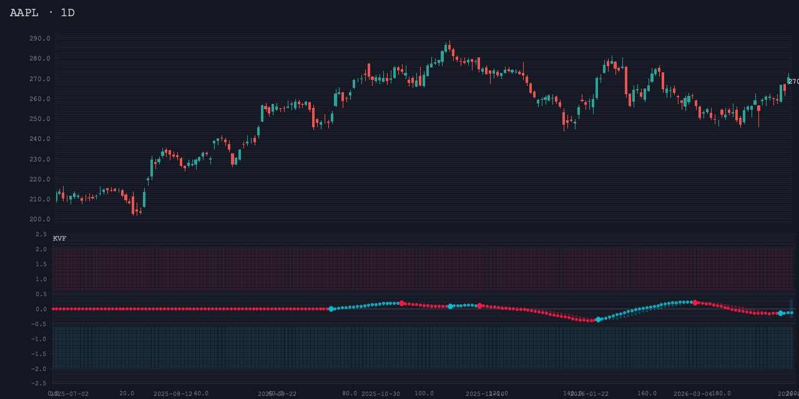

### `rsi_mfi_stoch`

RSI + Money Flow Index + Stochastic combo panel (all 0-100)

**Aliases:** `rsi_combo`, `combo`

**Parameters:**

| Param | Type | Default | Description |
|-------|------|---------|-------------|
| `rsi_length` | `integer` | `14` |  |
| `mfi_length` | `integer` | `14` |  |
| `stoch_k` | `integer` | `14` |  |
| `stoch_d` | `integer` | `3` |  |
| `stoch_smooth` | `integer` | `3` |  |
| `overbought` | `number` | `70` |  |
| `oversold` | `number` | `30` |  |
| `show_entry_dots` | `boolean` | `true` |  |
| `show_trend_bars` | `boolean` | `true` |  |

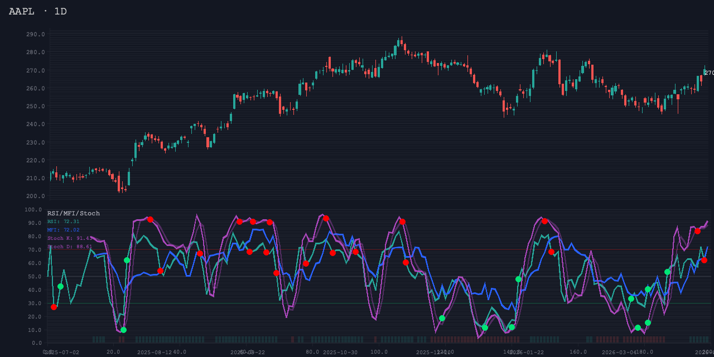

## External

### Summary

| Name | Aliases |
|------|---------|
| [`cvd`](#cvd) |  |
| [`funding`](#funding) | `funding_rate` |
| [`oi`](#oi) | `open_interest` |
| [`long_short`](#long_short) | `ls_ratio` |
| [`fear_greed`](#fear_greed) | `fng` |

### `cvd`

Cumulative Volume Delta — buy vs sell pressure

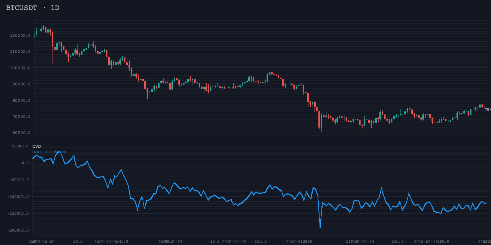

### `funding`

Funding Rate — crypto perpetual futures funding (Binance)

**Aliases:** `funding_rate`

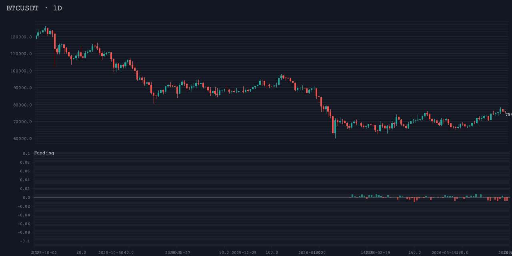

### `oi`

Open Interest — total outstanding futures contracts (Binance)

**Aliases:** `open_interest`

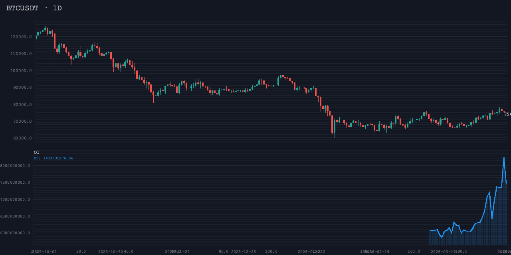

### `long_short`

Long/Short Ratio — account positioning (Binance)

**Aliases:** `ls_ratio`

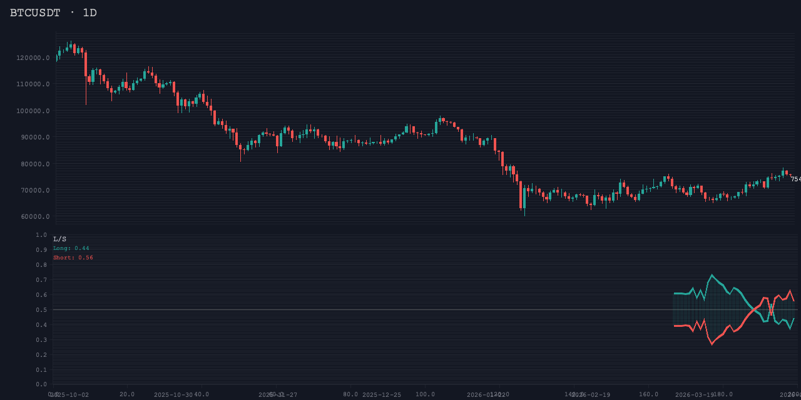

### `fear_greed`

Fear & Greed Index — market sentiment (alternative.me)

**Aliases:** `fng`

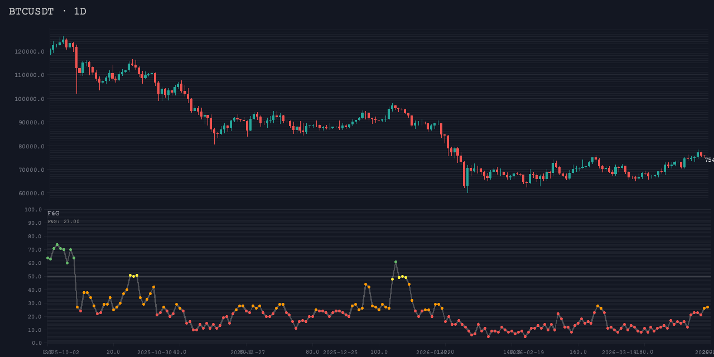

## Parameter examples (MCP)

```json
{"name": "rsi", "length": 21}
{"name": "bbands", "length": 30, "mult": 2.5}
{"name": "volume_profile", "bins": 32, "side": "right"}
```

Call the `list_indicators` MCP tool for the authoritative list with each
indicator's description, default parameters, and category at runtime.
